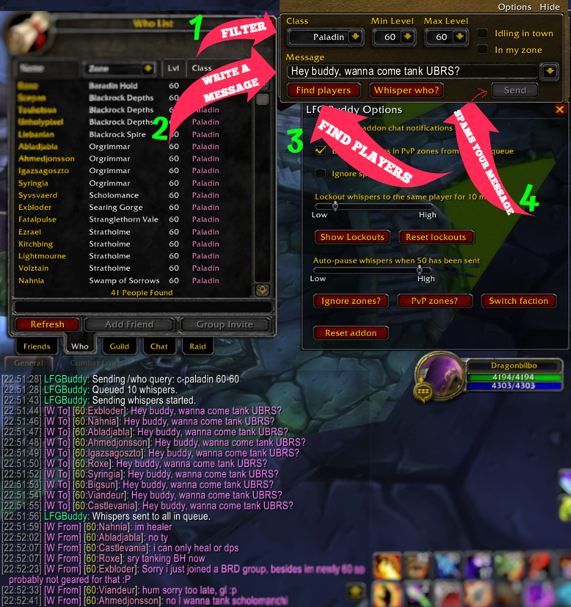

# LFGBuddy

Tired of copy/pasting the same message to 15 people from a /who command to find dungeon buddies? ME TOO!  

**LFG Buddy** is designed to do that task for you.

[Download LFGBuddy](https://github.com/hjortmar/lfgbuddy/raw/main/LFGBuddy.zip)

## ✨ Features and usage

  **You will find LFG Buddy when you open the Who tab**
  
1. Choose your filter by class and level range.
  
2. Write a poem in the messagebox, this is the message that the addon will send to players when you click "Send".
   - Once you have sent a message, it will be saved for quick reuse.
  
3. Click "Refresh", this will send a /who command based on your filter and capture the result to a whisper queue.
   - If you write your own /who command, the whisper queue will then be built from that result as long as LFGBuddy is visible.
   - The whisper queue will not capture players in instances, on your ignore list and battlegrounds (optional). 
  
4. Click "Send" to start sending messages to all players that were captured into the whisper queue.
   - Click "Whisper who?" to see to who the addon intends to send your message to.
     - Clicking "Wihpser who?" will also show a reason explaining why a player was not captured into the whisper queue.
   - By default, the addon is only able to send a message to a player once every 10 minutes to avoid being a nuissance.
   - Click "Pause" if you want the addon to stop sending messages.
   - Click "Reset" if you want the stop and clear the whisper queue.

## 🖼️ Screenshots

Updated the UI a tiny bit, couldn't be bothered to take a new screenshot.. some paint action going on. :P

## ⚙️ Installation

1. [Download LFGBuddy](https://github.com/hjortmar/lfgbuddy/raw/main/LFGBuddy.zip).
2. Extract in your `World of Warcraft\Interface\AddOns` directory.
3. Ensure the folder structure looks like this: 
Interface\AddOns\LFGBuddy\LFGBuddy.toc 
Interface\AddOns\LFGBuddy\Main.lua
4. Launch WoW and enable LFGBuddy on the character selection screen.

## 📝 Notes

LFGBuddy is only tested with a WotLK 3.3.5 (2009) client on **Epoch WoW 3.3.5**.  

## 📜 License

This addon is provided as-is. Modify and share freely, but please credit the original author.

