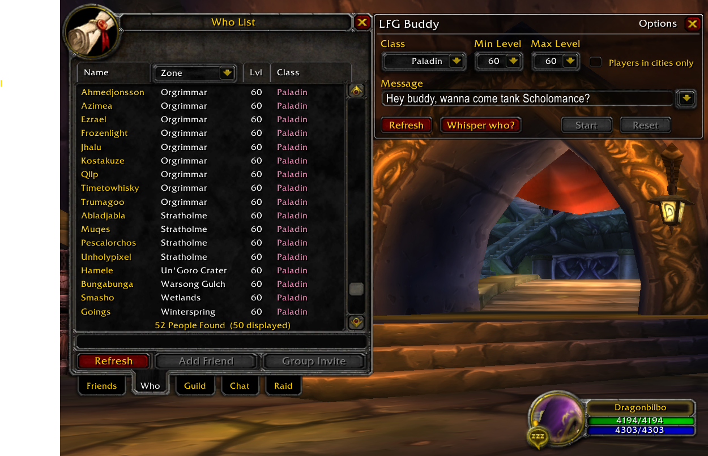
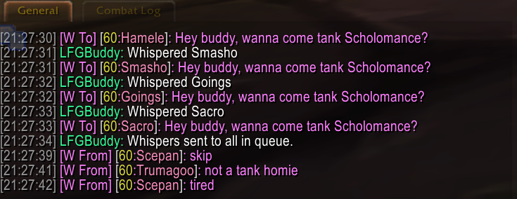

# LFGBuddy

LFGBuddy addon is designed to help you find buddies for dungeon groups efficiently.

## Features

- **Easily find players for your dungeons by contacting people with an somewhat automated whisper queue.**
1. Choose your filter by class and level range.
2. Click "Refresh" to create the whisper queue.
3. Click "Whisper who?" to see to who the addon intends to send your message to.
4. Click "Send" to start whispering everyone in the queue, pause and reset the queue if needed.

- **Whisper queue** – Players in instances, on your ignore list and optionally in pvp zones will not be put into the queue.
- **Whisper lockouts** - By default, the addon will only send a message to a player once every 10 minutes.
- **Snaps to Who frame** – LFGBuddy is positioned next to the Who tab for easy access.
- **Previous messages** – Keep track of recently sent messages for quick reuse.

- **Screenshots:**  

## Installation

1. Download the `LFGBuddy` folder.
2. Place it in your `World of Warcraft\Interface\AddOns` directory.
3. Ensure the folder structure looks like this:
Interface\AddOns\LFGBuddy\LFGBuddy.toc
Interface\AddOns\LFGBuddy\Main.lua
4. Launch WoW and enable LFGBuddy on the character selection screen.

## Notes

- LFGBuddy is only tested with a WotLK 3.3.5 (2009) client on **Epoch WoW 3.3.5**.  

## License

This addon is provided as-is. Modify and share freely, but please credit the original author.

